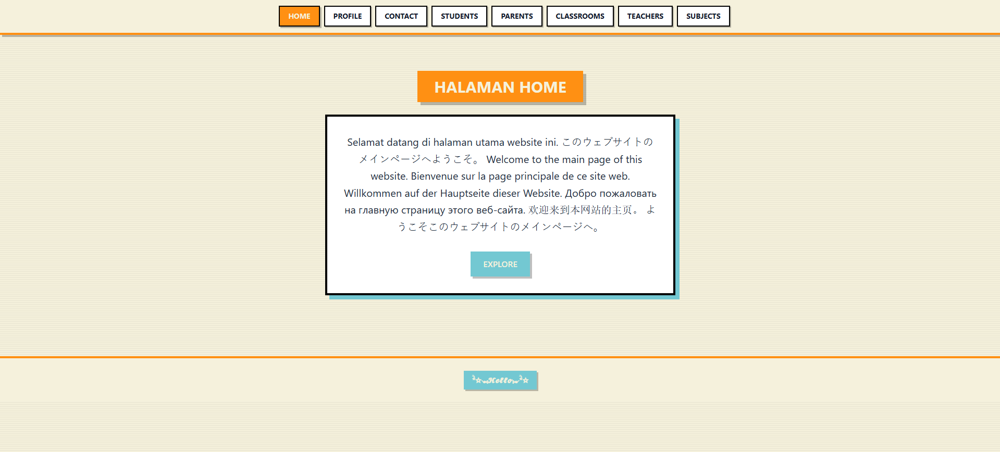
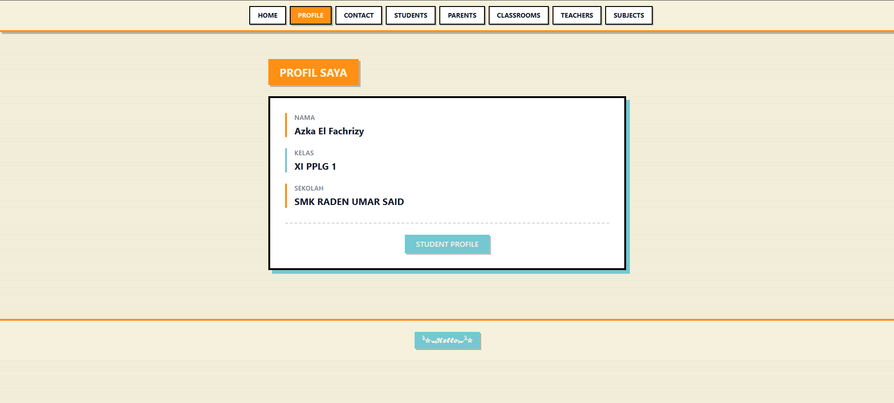
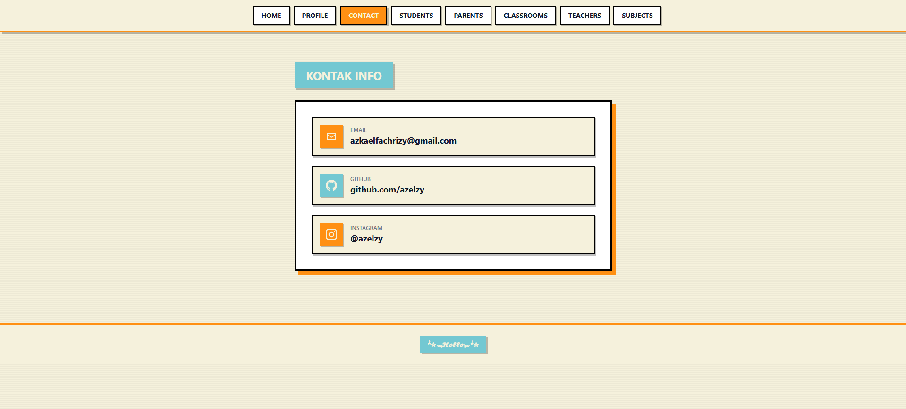
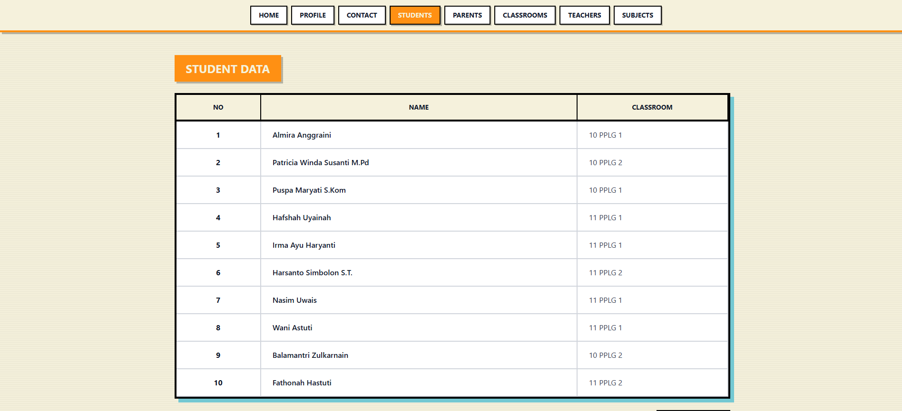
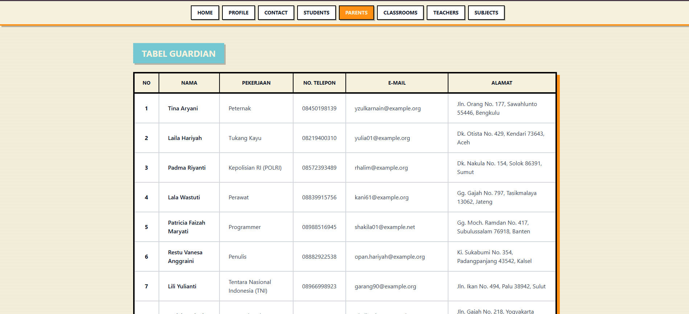
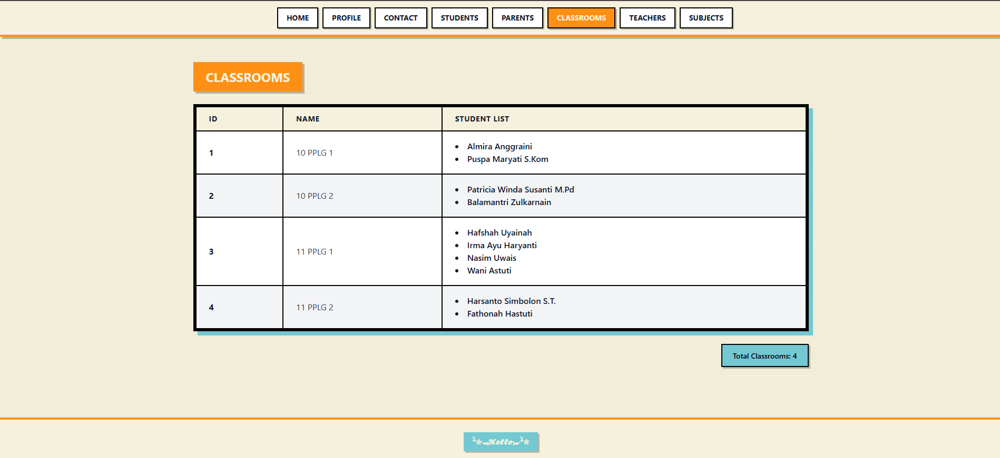
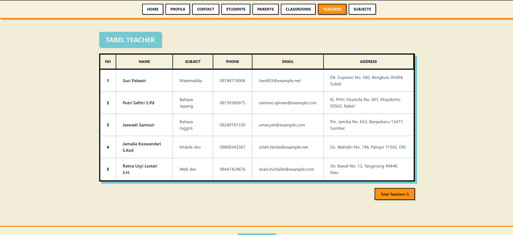
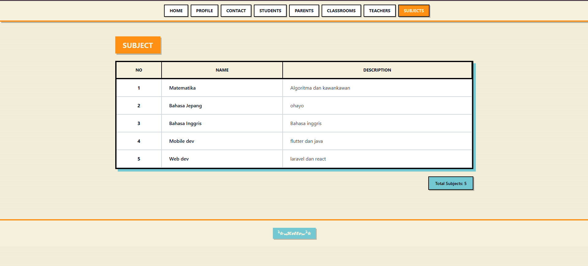
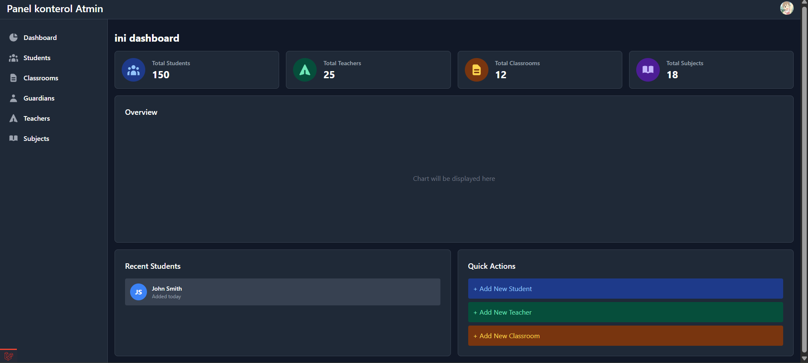

REMIDI

A modern school management system built with Laravel 11 and Tailwind CSS featuring a unique neobrutalism design style.


=======USER PAGE========








=======ADMIN PAGE========



## ✨ Features

- 🏠 **Home Page** - Multilingual welcome page with modern design
- 👤 **Profile Page** - Student profile information
- 📞 **Contact Page** - Social media and contact information
- 👨‍🎓 **Student Management** - View and manage student data
- 👪 **Guardian Management** - Parent/guardian information system
- 🏫 **Classroom Management** - Classroom organization with student lists
- 👨‍🏫 **Teacher Management** - Teacher profiles with subject assignments
- 📚 **Subject Management** - Academic subject catalog

## 🎨 Design

This project features a **Neobrutalism** design style with:
- Bold black borders and shadows
- Vibrant color palette (#FF9013, #73C8D2, #F5F1DC)
- Strong geometric shapes
- High contrast elements
- Playful yet functional interface

## 📋 Prerequisites

Before you begin, ensure you have the following installed:
- PHP >= 8.2
- Composer
- Node.js & NPM
- MySQL/MariaDB

## 🚀 Installation

### 1. Clone the Repository
```bash
git clone https://github.com/yourusername/school-management-system.git
cd school-management-system
```

### 2. Install PHP Dependencies
```bash
composer install
```

### 3. Install Node Dependencies
```bash
npm install
```

### 4. Environment Setup
```bash
cp .env.example .env
php artisan key:generate
```

### 5. Database Configuration

Edit your `.env` file with your database credentials:
```env
DB_CONNECTION=mysql
DB_HOST=127.0.0.1
DB_PORT=3306
DB_DATABASE=school_db
DB_USERNAME=your_username
DB_PASSWORD=your_password
```

### 6. Run Migrations
```bash
php artisan migrate
```

### 7. Seed Database
```bash
php artisan db:seed
```

This will generate:
- 4 Classrooms (10 PPLG 1, 10 PPLG 2, 11 PPLG 1, 11 PPLG 2)
- 10 Students with random classroom assignments
- 10 Guardians
- 5 Subjects (Matematika, Bahasa Jepang, Bahasa Inggris, Mobile dev, Web dev)
- 5 Teachers with subject assignments
- 1 Test User

### 8. Compile Assets
```bash
npm run dev
```

For production:
```bash
npm run build
```

### 9. Run the Application
```bash
php artisan serve
```

Visit `http://localhost:8000` in your browser.

## 📁 Project Structure

```
├── app/
│   ├── Http/Controllers/
│   │   ├── ClassroomController.php
│   │   ├── ContactController.php
│   │   ├── GuardianController.php
│   │   ├── HomeController.php
│   │   ├── ProfileController.php
│   │   ├── StudentController.php
│   │   ├── SubjectController.php
│   │   └── TeacherController.php
│   └── Models/
│       ├── Classroom.php
│       ├── Guardian.php
│       ├── Student.php
│       ├── Subject.php
│       └── Teacher.php
├── database/
│   ├── factories/
│   │   ├── ClassroomFactory.php
│   │   ├── GuardianFactory.php
│   │   ├── StudentFactory.php
│   │   ├── SubjectFactory.php
│   │   └── TeacherFactory.php
│   ├── migrations/
│   └── seeders/
│       └── DatabaseSeeder.php
├── resources/
│   ├── css/
│   │   └── app.css
│   └── views/
│       ├── components/
│       │   ├── header.blade.php
│       │   ├── layout.blade.php
│       │   ├── nav-link.blade.php
│       │   └── navbar.blade.php
│       ├── classroom.blade.php
│       ├── guardians.blade.php
│       ├── home.blade.php
│       ├── kontak.blade.php
│       ├── profil.blade.php
│       ├── student.blade.php
│       ├── subjects.blade.php
│       └── teachers.blade.php
└── routes/
    └── web.php
```

## 🗄️ Database Schema

### Students
- id, name, birth_date, classroom_id (FK), email, address, timestamps

### Classrooms
- id, name, timestamps

### Guardians
- id, name, job, phone, email, address, timestamps

### Subjects
- id, name, description, timestamps

### Teachers
- id, name, subject_id (FK), phone, email, address, timestamps

## 🔗 Relationships

- **Student** `belongsTo` **Classroom**
- **Classroom** `hasMany` **Students**
- **Teacher** `belongsTo` **Subject**
- **Subject** `hasMany` **Teachers**

## 🛣️ Routes

```php
GET /                 - Home page
GET /home            - Home page
GET /profil          - Profile page
GET /kontak          - Contact page
GET /student         - Student list
GET /guardians       - Guardian list
GET /classroom       - Classroom list
GET /teachers        - Teacher list
GET /subjects        - Subject list
```

## 🎨 Customization

### Colors
The main color palette is defined in the Tailwind classes:
- Primary Orange: `#FF9013`
- Secondary Cyan: `#73C8D2`
- Background Beige: `#F5F1DC`

### Components
Blade components are located in `resources/views/components/`:
- `layout.blade.php` - Main layout wrapper
- `navbar.blade.php` - Navigation menu
- `nav-link.blade.php` - Active link styling
- `header.blade.php` - Page header

## 📝 Seeding Custom Data

To add custom data, modify the seeders in `database/seeders/` or use Laravel's tinker:

```bash
php artisan tinker
```

```php
// Create a new student
Student::create([
    'name' => 'John Doe',
    'birth_date' => '2005-01-01',
    'classroom_id' => 1,
    'email' => 'john@example.com',
    'address' => 'Jakarta'
]);
```

## 🧪 Testing

Run the application:
```bash
php artisan serve
```

Access the pages:
- Home: http://localhost:8000/home
- Teachers: http://localhost:8000/teachers
- Subjects: http://localhost:8000/subjects

## 🤝 Contributing

1. Fork the project
2. Create your feature branch (`git checkout -b feature/AmazingFeature`)
3. Commit your changes (`git commit -m 'Add some AmazingFeature'`)
4. Push to the branch (`git push origin feature/AmazingFeature`)
5. Open a Pull Request

## 📄 License

This project is open-sourced software licensed under the [MIT license](https://opensource.org/licenses/MIT).

## 👨‍💻 Author

**Azka El Fachrizy**
- Email: azkaelfachrizy@gmail.com
- GitHub: [@azelzy](https://github.com/azelzy)
- Instagram: [@azelzy](https://instagram.com/azelzy)

## 🙏 Acknowledgments

- Laravel Framework
- Tailwind CSS
- Neobrutalism Design Inspiration

---

⭐ **Star this repository if you find it helpful!**

